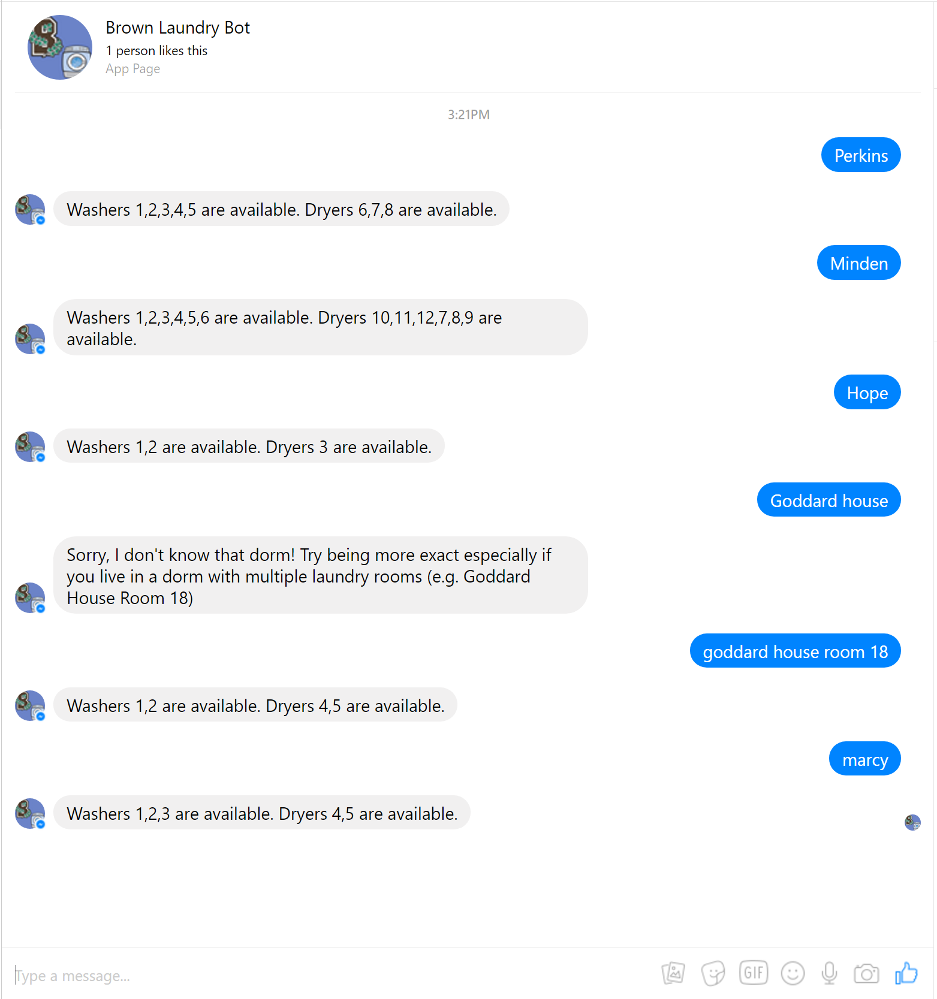

# Brown Laundry Bot

This is a small bot using the Brown API to return the status of laundry machines in a given dorm.

It uses Express and the Node client for the Facebook Messenger Platform by [remixz](https://github.com/remixz/messenger-bot), that provides a number of methods to perform common tasks, like authenticating with Facebook, verifying your token and sending messages.

